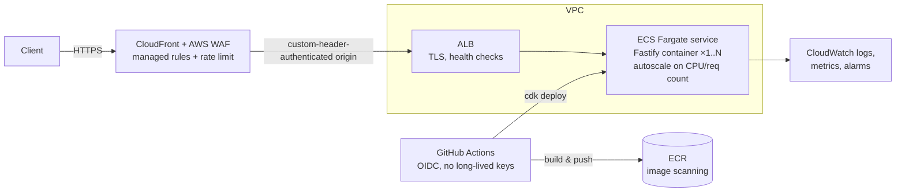

# MP3 Frame Analysis — Solution Plan (v2 — decisions resolved)

> **Status:** All open decisions resolved 2026-08-14; scope expanded to include a simple
> analysis front-end. The authoritative handoff document is **SPEC.md** — this file remains
> as the planning record.
>
> **mediainfo verification (2026-08-14):** `mediainfo --ParseSpeed=1 -f` reports
> **Frame count: 6089** for the sample (audio frames only; samples count 7,014,528 = 6089 × 1152,
> duration 2 min 39.059 s). Our API returns **6090** (all physical frames, per the assignment
> wording), and the README + `/analyze` endpoint reconcile the two: 6090 physical = 6089 audio
>
> - 1 Xing metadata frame.

**Assignment:** Foundation Health technical assessment — TypeScript API at `POST /file-upload`
that accepts an MP3 upload and responds `{ "frameCount": <number> }` for MPEG-1 Audio Layer III.

**Stretch goal (ours, not theirs):** a deployed, scalable, secure, publicly reachable version on AWS.

**End deliverable of this planning phase:** a detailed implementation specification (`SPEC.md`)
that could be handed to another engineer or model to build without further clarification.

---

## 1. Ground truth on the sample file (already verified locally)

Analyzed `sample (2).mp3` (1,458,172 bytes) with a throwaway parser:

| Property        | Value                                                          |
| --------------- | -------------------------------------------------------------- |
| Container       | ID3v2.4.0 tag (34 bytes) + MPEG audio; audio starts at byte 44 |
| Format          | MPEG-1 Layer III, 44.1 kHz, stereo, **VBR** (32–160 kbps mix)  |
| Physical frames | **6090** (clean parse, zero resync skips, zero trailing bytes) |
| Xing header     | Present in first frame; declares **6089** frames               |
| ID3v1 trailer   | None                                                           |

The first "frame" is a Xing/Info VBR header — a structurally valid MPEG frame that carries
metadata rather than audio. Its declared count (6089) excludes itself. This is the classic
off-by-one in this assignment and **Decision 1** below.

The file being VBR also matters: the parser must read the bitrate from _every_ frame header,
not assume a constant frame length.

---

## 2. Part 1 — The application (the actual submission)

### 2.1 Stack

| Concern        | Choice (proposed)                                       | Why                                                                                                                       |
| -------------- | ------------------------------------------------------- | ------------------------------------------------------------------------------------------------------------------------- |
| Runtime        | Node.js 22 LTS                                          | Current LTS; native `fetch`, stable test runner ecosystem                                                                 |
| Language       | TypeScript, `strict: true`                              | Required; strict mode shows TS competence                                                                                 |
| HTTP framework | **Fastify** + `@fastify/multipart`                      | First-class streaming multipart, schema-based responses, typed, faster than Express, and less boilerplate than raw `http` |
| Tests          | Vitest + `fastify.inject()`/light-my-request            | Fast, TS-native, no build step in test loop                                                                               |
| Lint/format    | ESLint (typescript-eslint, flat config) + Prettier      | The "standardised tooling" criterion                                                                                      |
| CI             | GitHub Actions: lint → typecheck → test → build         | "Uses Git effectively" evidence                                                                                           |
| Container      | Multi-stage Dockerfile (distroless or alpine, non-root) | Local prod parity + feeds Part 2                                                                                          |

Alternatives considered: Express (ubiquitous but weaker streaming/typing story), Hono (nice but
multipart streaming is less mature), raw `node:http` (maximum "no magic" points, more boilerplate).

### 2.2 Architecture — parser is the star

Three layers, dependency arrows pointing inward; the parser never imports anything from HTTP land:

```
src/
  server.ts               # entrypoint: config, listen, graceful shutdown
  app.ts                  # buildApp(): Fastify instance wiring (testable factory)
  routes/
    file-upload.ts        # POST /file-upload: multipart stream -> service -> JSON
  services/
    frame-count.service.ts# orchestrates: stream -> parser, maps parser errors -> HTTP errors
  parser/
    mp3-frame-counter.ts  # pure streaming state machine: update(chunk), finalize()
    frame-header.ts       # 4-byte header decode: tables, validation, frame length calc
    id3.ts                # ID3v2 header detect/skip (sync-safe size), ID3v1 trailer
    xing.ts               # Xing/Info frame detection (Decision 1)
    types.ts              # discriminated unions, branded types, error classes
  errors.ts               # typed domain errors -> HTTP mapping in one place
```

**Parser contract (framework-agnostic, O(1) memory):**

```ts
const counter = new Mp3FrameCounter();
for await (const chunk of stream) counter.update(chunk);
const result = counter.finalize(); // { frameCount: number } or throws typed error
```

State machine states: `EXPECT_ID3_OR_FRAME → SKIPPING_ID3V2 → EXPECT_FRAME_HEADER →
SKIPPING_FRAME_BODY → DONE`, with a small carry buffer (< 4 bytes + partial header) so chunk
boundaries falling mid-header are handled — this is a dedicated test case.

**Byte-level rules (MPEG-1 Layer III only, per the brief):**

- Frame sync: 11 set bits (`0xFF`, `0xE0` mask); then require version bits `11` (MPEG-1) and
  layer bits `01` (Layer III); reject bitrate index `0` (free) and `15` (bad), sample-rate index `3`.
- Frame length = `⌊144 × bitrate / sampleRate⌋ + padding` bytes; skip exactly that far — never
  byte-scan inside frame bodies (avoids false syncs in audio data).
- ID3v2 at offset 0: skip 10-byte header + sync-safe size (+ 10 if footer flag). ID3v1 (`TAG`,
  last 128 bytes) tolerated at EOF.
- Non-MPEG-1-L3 frames or garbage between frames: bounded resync scan; if the file never yields a
  valid MPEG-1 L3 frame → typed "not a supported MP3" error (400 to client).
- Truncated final frame: **Decision 2**.

### 2.3 API behavior & error model

| Case                         | Status                      | Body                                                                       |
| ---------------------------- | --------------------------- | -------------------------------------------------------------------------- |
| Valid MP3                    | 200                         | `{ "frameCount": 6090 }` (`content-type: application/json; charset=utf-8`) |
| No file part / wrong field   | 400                         | `{ "error": { "code": "NO_FILE", "message": "..." } }`                     |
| Not an MPEG-1 Layer III file | 422 or 400 (**Decision 3**) | `{ "error": { "code": "UNSUPPORTED_FORMAT", ... } }`                       |
| File exceeds size cap        | 413                         | `{ "error": { "code": "FILE_TOO_LARGE", ... } }`                           |
| Wrong method / route         | 404/405                     | JSON error envelope                                                        |
| Unexpected failure           | 500                         | Generic JSON error, details only in server logs                            |

- Upload is **streamed** from the multipart part directly into the parser — no buffering the whole
  file in memory, no temp files. Scalability criterion answered by design, not by hardware.
- Configurable max upload size (default e.g. 500 MB) as an env var; protects the service, and the
  cap is documented rather than hidden.
- Structured logging (pino, built into Fastify) with request IDs; errors logged with cause chains.

### 2.4 Testing strategy

- **Unit — frame-header:** table-driven tests for the 4-byte decoder (every bitrate/sample-rate
  index, padding on/off, each rejection reason).
- **Unit — parser:** synthetic MP3 builders in test helpers (craft N valid frames + optional ID3v2/
  Xing/junk), then: exact counts, chunk-split-mid-header (feed 1 byte at a time), ID3 skipping,
  truncation, garbage prefix/suffix, empty input.
- **Integration:** boot app via `buildApp()`, real multipart POST of the sample file, assert
  `{ frameCount: 6090 }` (or 6089 per Decision 1), plus every error path end-to-end.
- **Verification:** install `mediainfo` (brew) and cross-check the sample; record the comparison in
  the README (the brief explicitly suggests this).

### 2.5 Git & README

- Conventional commits telling the build story: scaffold/tooling → header decoder (TDD) → streaming
  counter → HTTP layer → hardening → docs. Small, reviewable commits; no giant "initial commit".
- README: quickstart (`npm i && npm run dev`), `curl -F "file=@sample.mp3" .../file-upload` example,
  design decisions (esp. Xing counting policy with the 6089/6090 explanation — this reads as deep
  understanding at interview), known limitations (free bitrate, other MPEG versions), and
  "with more time" notes as the brief invites.

---

## 3. Part 2 — AWS deployment (public, scalable, secure)

### 3.1 Requirements this must satisfy

Preserve the exact sync contract (`POST /file-upload` → JSON), accept large uploads, autoscale,
be publicly reachable over HTTPS, and be defensible security-wise — while staying tear-down-able
and not silly-expensive for a demo.

### 3.2 Recommended architecture (Option A): CloudFront + WAF → ALB → ECS Fargate



Why this over serverless: **API Gateway/Lambda cap request payloads at ~6–10 MB**, which directly
fails the "handles large files" criterion for a sync upload endpoint. ALB→Fargate streams bodies of
any size straight into the same container we built in Part 1 — one codebase, no contract change.

- **IaC:** AWS CDK in TypeScript (**Decision 5**) — same language as the app, one-command
  `cdk deploy` / `cdk destroy`.
- **Network:** VPC with the Fargate tasks' security group accepting traffic only from the ALB; ALB
  accepts only CloudFront (origin custom header check + AWS-managed prefix list). NAT-free variant
  via ECR/S3/CloudWatch VPC endpoints or public-subnet tasks (**Decision 6** — cost).
- **Security:** WAF managed core rule set + per-IP rate limiting; TLS 1.2+; non-root read-only
  container; ECR scan-on-push; least-privilege task role (this app needs ~zero AWS API access —
  it never stores the file, which is itself a nice privacy/security story); no secrets needed.
- **Operations:** CloudWatch dashboards + alarms (5xx rate, p99 latency, task count), structured
  logs shipped automatically, container health checks, graceful shutdown for rolling deploys.
- **Cost ballpark:** ALB ~$17/mo + Fargate (0.25 vCPU min task) ~$9/mo + CloudFront/WAF ~$10/mo +
  NAT-or-endpoints $0–32/mo ⇒ roughly **$35–70/mo**, ~$0 after `cdk destroy`.

### 3.3 Alternatives (documented in the spec, not built)

- **Option B — Lambda + API Gateway:** cheapest, scales to zero, but the ~6 MB payload cap breaks
  large uploads; honest sync contract only for small files.
- **Option C — S3 presigned upload + async processing:** the "right" cloud-native answer for huge
  files, but it changes the API contract (upload → poll/webhook), so it stays a documented
  evolution path, not the demo.
- **Option D — App Runner:** simplest managed container option; fewer security/architecture knobs
  to show off. Good fallback if we want minimal ops.

### 3.4 AWS account hygiene

**Out of scope** for this phase per project decision 2026-08-14. Deployment targets
`us-east-1`; broader account credential and identity setup is handled separately from
this project.

---

## 4. Part 3 — What the final SPEC.md will contain

1. Context & goals; explicit in/out of scope
2. MP3/MPEG-1-L3 binary format reference (tables, formulas, worked example from the sample file)
3. Parser functional spec: state machine, every edge-case policy, typed error catalogue
4. API spec: routes, request/response schemas, full status-code matrix, limits
5. Project layout, tooling config expectations, npm scripts
6. Test plan: enumerated test cases with expected values (incl. sample = 6090/6089)
7. Acceptance criteria checklist mapped to the assignment's evaluation criteria
8. Infrastructure spec: CDK stack inventory, network diagram, security controls, CI/CD pipeline,
   cost & teardown, account-prep runbook
9. Git workflow & README requirements
10. Handoff notes: build order, verification steps (mediainfo cross-check, load test with a
    large file)

---

## 5. Decisions (RESOLVED 2026-08-14)

| #   | Decision                       | Resolution                                                                                                                                                                                                                                                                             |
| --- | ------------------------------ | -------------------------------------------------------------------------------------------------------------------------------------------------------------------------------------------------------------------------------------------------------------------------------------- |
| 1   | Frame-count semantics          | **All physical frames (6090)**. mediainfo verified: it reports 6089 (audio frames only); README and `/analyze` explain and reconcile both numbers.                                                                                                                                     |
| 2   | Truncated final frame          | **Count it** if the full 4-byte header was valid; surface a warning in `/analyze`.                                                                                                                                                                                                     |
| 3   | Unsupported-format status code | **422**                                                                                                                                                                                                                                                                                |
| 4   | HTTP framework                 | **Fastify**                                                                                                                                                                                                                                                                            |
| 5   | IaC                            | **CDK (TypeScript)** — staying within the AWS stack                                                                                                                                                                                                                                    |
| 6   | Compute                        | **Fargate + ALB (+ CloudFront + WAF)** — cost not a constraint at this stage; standard best-practice networking (private subnets + NAT, 2 AZs)                                                                                                                                         |
| 7   | Repo strategy                  | **Single repo** with a clearly separated `infra/` folder                                                                                                                                                                                                                               |
| 8   | Domain                         | **Default CloudFront URL** (documented tradeoff: no ACM cert possible on the ALB's amazon DNS name, so the CloudFront→ALB hop uses HTTP locked down by security group + secret origin header; custom domain later enables end-to-end TLS)                                              |
| 9   | Region                         | **us-east-1**                                                                                                                                                                                                                                                                          |
| 10  | _(new scope)_ Front-end        | **Yes** — simple single-page UI served by the same app: upload a file, see a full narrative breakdown of the analysis with frames broken down by type. The assignment's strict `POST /file-upload` contract stays untouched; rich detail lives at a separate `POST /analyze` endpoint. |

---

## 6. Suggested timeline (5-day window)

| Day | Work                                                                                  |
| --- | ------------------------------------------------------------------------------------- |
| 1   | Finalize spec from this plan; repo scaffold + tooling + CI; header decoder TDD        |
| 2   | Streaming parser complete incl. edge cases; mediainfo cross-verification              |
| 3   | HTTP layer, error model, integration tests, Dockerfile, README — **submission-ready** |
| 4   | AWS account prep; CDK stacks; deploy; smoke + large-file test                         |
| 5   | Polish, load test, docs, buffer                                                       |
