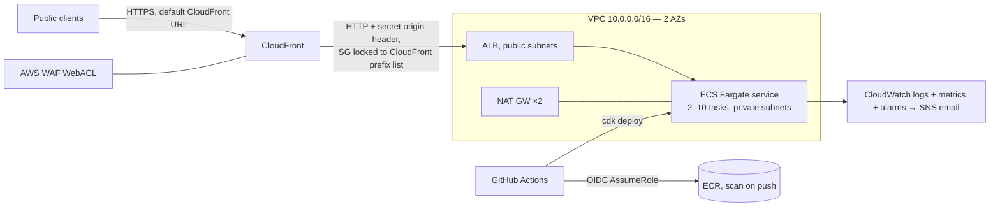

# MP3 Frame Analyzer — Implementation Specification

**Version:** 1.0 (2026-08-14) · **Status:** Ready for implementation
**Audience:** An engineer or coding agent implementing the system without further clarification.
Where this document and PLAN.md disagree, this document wins.

---

## 1. Overview

Build a TypeScript service that accepts an MP3 upload and counts its MPEG frames, satisfying the
Foundation Health assignment exactly, plus two above-and-beyond layers:

1. **Assignment core** — `POST /file-upload` → `{ "frameCount": <number> }` for MPEG-1 Audio
   Layer III files, with a hand-written streaming parser (no MP3-parsing npm packages).
2. **Analysis experience** — `POST /analyze` returning a rich structured report, and a simple
   single-page front-end that renders that report as a full narrative with frames broken down
   by type.
3. **AWS deployment** — public, scalable, secure: CloudFront + WAF → ALB → ECS Fargate, defined
   with CDK (TypeScript), deployed from GitHub Actions via OIDC, in `us-east-1`.

### 1.1 Locked decisions

| Topic | Decision |
|---|---|
| Frame-count semantics | Count **every physical MPEG-1 Layer III frame**, including the Xing/Info metadata frame. Sample file ⇒ **6090**. |
| mediainfo relationship | mediainfo (full parse) reports **6089** for the sample — audio frames only. README and `/analyze` must reconcile: 6090 physical = 6089 audio + 1 Xing frame. |
| Truncated final frame | Counted if its full 4-byte header was valid; reported as a warning in `/analyze`. |
| Unsupported format status | **422** |
| HTTP framework | Fastify |
| IaC | AWS CDK, TypeScript |
| Compute | ECS Fargate behind ALB, fronted by CloudFront + WAF |
| Repo | Single repo; `infra/` and `web/` folders alongside the API |
| Domain | Default CloudFront URL (no custom domain) |
| Region | `us-east-1` |

### 1.2 Out of scope

- MPEG-2 / MPEG-2.5, Layers I & II (detect → reject with 422; do not parse).
- Free-format bitrate (bitrate index 0) — reject/skip, documented limitation.
- Decoding audio, CRC verification, tag content parsing (only tag *skipping* and basic identification).
- Persisting uploads anywhere (the file is never written to disk or object storage — a deliberate privacy/security property; state it in the README).
- Authentication (public demo endpoint; abuse handled by WAF rate limiting and size caps).
- **AWS account maintenance** (root-credential remediation, MFA, identity setup, billing
  hygiene) — explicitly out of scope for this phase per project decision 2026-08-14.
  Deployment assumes working admin-capable credentials, region `us-east-1`, and a completed
  `cdk bootstrap`.

---

## 2. MPEG-1 Layer III format reference (normative for the parser)

### 2.1 Frame header — 4 bytes, big-endian bit layout `AAAAAAAA AAABBCCD EEEEFFGH IIJJKLMM`

| Field | Bits | Meaning | Parser rule |
|---|---|---|---|
| A | 11 | Frame sync, all 1s | `byte0 == 0xFF && (byte1 & 0xE0) == 0xE0` |
| B | 2 | MPEG version: `00`=2.5, `01`=reserved, `10`=2, `11`=1 | require `11` |
| C | 2 | Layer: `00`=reserved, `01`=III, `10`=II, `11`=I | require `01` |
| D | 1 | Protection: `0`=16-bit CRC follows header, `1`=no CRC | record for stats; affects Xing offset (§2.4) |
| E | 4 | Bitrate index | V1L3 table below; reject `0` (free) and `15` (bad) |
| F | 2 | Sample rate: `00`=44100, `01`=48000, `10`=32000, `11`=reserved | reject `11` |
| G | 1 | Padding: adds 1 byte to frame length | used in length calc |
| H | 1 | Private bit | ignore |
| I | 2 | Channel mode: `00`=stereo, `01`=joint stereo, `10`=dual channel, `11`=mono | record for stats; affects Xing offset |
| J | 2 | Mode extension | ignore |
| K | 1 | Copyright | ignore (may surface in `/analyze`) |
| L | 1 | Original | ignore (may surface in `/analyze`) |
| M | 2 | Emphasis (`10` reserved) | do **not** reject; ignore |

**Bitrate table (MPEG-1 Layer III), kbps by index 1–14:**
`32, 40, 48, 56, 64, 80, 96, 112, 128, 160, 192, 224, 256, 320`

### 2.2 Frame length (bytes), MPEG-1 Layer III

```
frameLength = floor(144 * bitrateBps / sampleRateHz) + padding
```

Worked example (sample file's first frame): 64 kbps, 44 100 Hz, no padding →
`floor(144 × 64000 / 44100) = 209` bytes. Each frame carries **1152 samples**;
at 44.1 kHz one frame spans 1152/44100 ≈ 26.122 ms.

The header's 4 bytes are *included* in `frameLength`. After reading a valid header, advance
exactly `frameLength` bytes from the header start to reach the next header. **Never byte-scan
inside a frame body** — audio payload can contain false sync patterns.

### 2.3 Tags

- **ID3v2** (start of file): `"ID3"` + 1 version byte + 1 revision byte + 1 flags byte +
  4-byte **sync-safe** size (7 bits per byte: `size = (b6&0x7F)<<21 | (b7&0x7F)<<14 | (b8&0x7F)<<7 | (b9&0x7F)`).
  Total to skip: `10 + size`, plus another 10 if flags bit 4 (`0x10`, footer) is set.
  Record version (`2.<major>.<rev>`) and total tag size for `/analyze`.
- **ID3v1** (end of file): exactly 128 bytes beginning `"TAG"`. In a streaming parser file size
  isn't known up front, so: at finalize, if the unconsumed trailing region is exactly 128 bytes
  and begins `"TAG"`, classify it as ID3v1 (not a warning). Any other trailing non-frame bytes →
  `TRAILING_BYTES` warning with the byte count.

### 2.4 Xing/Info VBR header (frame classification)

The first MPEG frame of most encoder outputs carries a Xing (VBR) or Info (CBR) header instead of
audio. It **is a structurally valid MPEG frame** and counts toward `frameCount`.

Locate within the first valid frame: tag offset = `4 + (protection ? 0 : 2) + sideInfoSize`, where
`sideInfoSize` for MPEG-1 is **17** (mono) or **32** (all other channel modes). At that offset:

- ASCII `"Xing"` (VBR) or `"Info"` (CBR/LAME) → 4-byte big-endian flags follow:
  bit 0 = frame count present (4-byte BE integer next), bit 1 = byte count, bit 2 = 100-byte TOC,
  bit 3 = quality indicator. Read whichever are present, in that order.
- The declared frame count **excludes the Xing frame itself** — this is the 6089 vs 6090 story.
- Also detect Fraunhofer `"VBRI"` at fixed offset `4 + 32` from the frame start (presence +
  its frame count at offset 14 within the VBRI block); report-only, low priority.

Classify each counted frame as `kind: "audio"` or `kind: "vbr-header"` (only the frame containing
Xing/Info/VBRI gets `vbr-header`).

### 2.5 Resync & edge policies (normative)

| Situation | Policy |
|---|---|
| Bytes before first valid frame (after any ID3v2) | Scan forward byte-by-byte for a valid header; count skipped bytes. If EOF with 0 frames found → `UNSUPPORTED_FORMAT` error. |
| Invalid header where next frame expected (mid-stream) | Byte-by-byte scan to next valid MPEG-1 L3 header; accumulate `resyncedBytes`; emit one `RESYNC` warning with total. |
| Valid header, body truncated by EOF | **Count the frame**; warning `TRUNCATED_FINAL_FRAME`. |
| 1–3 bytes of a possible header at EOF | Not counted; falls into trailing-bytes/ID3v1 handling (§2.3). |
| MPEG-2/2.5 or Layer I/II headers | Not valid frames for this parser. If the file yields zero MPEG-1-L3 frames → `UNSUPPORTED_FORMAT`. |
| Free bitrate (index 0) | Treated as invalid header (resync applies). |
| Empty upload (0 bytes) | `UNSUPPORTED_FORMAT` (message: empty file). |

### 2.6 Ground truth — provided sample (`sample.mp3`, committed as a test fixture)

| Property | Value |
|---|---|
| Size | 1 458 172 bytes |
| ID3v2 | v2.4.0, flags 0, tag size 34 ⇒ audio starts at byte **44**; no ID3v1 |
| First frame | Xing header, flags `0x0F`, declared frame count **6089** |
| Physical frames | **6090** (zero resync bytes, zero trailing bytes) |
| Format | MPEG-1 Layer III, 44 100 Hz, VBR |
| Bitrate histogram (kbps→frames, incl. Xing frame) | 32→49, 40→11, 48→23, 56→102, 64→2352, 80→3374, 96→136, 112→27, 128→11, 160→5 |
| Duration | 6089 × 1152 / 44100 = **159.059 s** (2 min 39.06 s) |
| mediainfo (`--ParseSpeed=1 -f`) | Frame count **6089**, Samples count 7 014 528, Duration 159 059 ms |

---

## 3. Repository layout

```
mp3-frame-analyzer/
├── src/                        # API + parser (the assignment submission core)
│   ├── server.ts               # entrypoint: env config, listen, graceful shutdown (SIGTERM)
│   ├── app.ts                  # buildApp(opts): Fastify factory — all wiring, no listen()
│   ├── config.ts               # typed env parsing (PORT, MAX_UPLOAD_BYTES, LOG_LEVEL)
│   ├── routes/
│   │   ├── file-upload.ts      # POST /file-upload (assignment contract — keep pristine)
│   │   ├── analyze.ts          # POST /analyze (rich report)
│   │   └── health.ts           # GET /healthz
│   ├── services/
│   │   └── analysis.service.ts # multipart stream → parser; domain error → HTTP mapping
│   ├── parser/                 # pure, zero-dependency, framework-agnostic
│   │   ├── mp3-frame-counter.ts# streaming state machine (update/finalize)
│   │   ├── frame-header.ts     # 4-byte decode + tables + frameLength
│   │   ├── id3.ts              # ID3v2 skip, ID3v1 classification
│   │   ├── xing.ts             # Xing/Info/VBRI detection
│   │   └── types.ts            # FrameHeader, AnalysisReport, warnings, error classes
│   └── errors.ts               # AppError hierarchy + toHttpResponse()
├── web/                        # front-end (Vite + vanilla TypeScript, no framework)
│   ├── index.html
│   ├── src/
│   │   ├── main.ts             # upload handling, fetch /analyze, render
│   │   ├── narrative.ts        # report → narrative sections (pure, unit-tested)
│   │   └── components/         # histogram bars, stat tiles, warnings list (plain TS/DOM)
│   └── vite.config.ts          # dev proxy → localhost API; build → web/dist
├── infra/                      # CDK app (TypeScript) — §7
│   ├── bin/app.ts
│   ├── lib/{network,repository,service,edge,cicd}-stack.ts
│   └── cdk.json
├── test/
│   ├── fixtures/sample.mp3     # the provided file (committed)
│   ├── fixtures/generated/     # large synthetic fixtures (git-ignored, built on demand)
│   ├── helpers/mp3-builder.ts  # synthetic MP3 construction (§6.1)
│   ├── unit/                   # parser + narrative tests
│   └── integration/            # app-level HTTP tests (fastify inject / light-my-request)
├── docs/
│   ├── PLAN.md / SPEC.md       # planning record + this spec
│   └── evidence/               # generated human-readable test evidence (§6.3)
├── scripts/                    # fixture generation + evidence-doc generation (§6.3)
├── Dockerfile                  # multi-stage; serves API + built web/dist
├── .github/workflows/{ci,deploy}.yml
├── package.json                # npm workspaces optional; keep simple if single package works
├── tsconfig.json  eslint.config.js  .prettierrc  vitest.config.ts  .nvmrc  README.md
```

Dependency rule: `parser/` imports nothing outside itself and Node built-ins (`node:buffer` only).
`web/` talks to the API only via HTTP. `infra/` never imports `src/`.

---

## 4. API specification

All responses are JSON with `content-type: application/json; charset=utf-8`.

### 4.1 `POST /file-upload` — assignment contract (do not extend)

- Request: `multipart/form-data` with exactly one file part; **accept any field name** (the
  assignment doesn't specify one; first file part wins, additional file parts → 400 `MULTIPLE_FILES`).
- The part's stream is piped directly into `Mp3FrameCounter` — no temp files, no full buffering.
- Success **200**: `{ "frameCount": 6090 }` — number, nothing else in the body.

### 4.2 `POST /analyze` — rich report

Same request shape as `/file-upload`. Success **200** returns:

```jsonc
{
  "frameCount": 6090,                          // identical semantics to /file-upload
  "file": { "fileName": "sample.mp3", "sizeBytes": 1458172 },
  "format": {
    "mpegVersion": "1", "layer": "III",
    "sampleRateHz": 44100,
    "channelMode": "joint-stereo",             // dominant mode: "stereo"|"joint-stereo"|"dual-channel"|"mono"
    "bitRateMode": "VBR",                      // "VBR" if >1 distinct bitrate else "CBR"
    "averageBitRateKbps": 73.3                 // (audio bytes × 8) / duration, 1 decimal
  },
  "tags": {
    "id3v2": { "present": true, "version": "2.4.0", "totalSizeBytes": 44 },
    "id3v1": { "present": false }
  },
  "vbrHeader": {
    "present": true, "kind": "Xing",           // "Xing" | "Info" | "VBRI" | null kind when absent
    "declaredFrameCount": 6089,                // null if flag absent
    "declaredByteCount": 1458128,              // null if flag absent (value illustrative)
    "hasToc": true, "qualityIndicator": 57     // null if absent
  },
  "frames": {                                  // "broken down by type" — feeds the UI
    "physicalTotal": 6090,
    "byKind": { "audio": 6089, "vbrHeader": 1 },
    "byBitRateKbps": { "32": 49, "40": 11, "48": 23, "56": 102, "64": 2352,
                        "80": 3374, "96": 136, "112": 27, "128": 11, "160": 5 },
    "bySampleRateHz": { "44100": 6090 },
    "byChannelMode": { "joint-stereo": 6090 },
    "padded": 1234, "withCrc": 0               // counts (values illustrative)
  },
  "timing": {
    "samplesPerFrame": 1152,
    "totalSamples": 7014528,                   // audio frames × 1152
    "durationSeconds": 159.059,                // audio frames × 1152 / sampleRate, 3 decimals
    "msPerFrameAtPrimaryRate": 26.122
  },
  "layout": { "audioStartOffset": 44, "bytesParsed": 1458172, "trailingBytes": 0 },
  "warnings": []                               // e.g. [{ "code": "RESYNC", "message": "...", "bytesSkipped": 12 }]
}
```

Warning codes: `RESYNC`, `TRUNCATED_FINAL_FRAME`, `TRAILING_BYTES`, `MIXED_SAMPLE_RATES`,
`MIXED_CHANNEL_MODES`. Duration and totals use **audio frames only** (metadata frame excluded),
matching mediainfo — say so in the README.

### 4.3 Errors (both upload endpoints) and other routes

Envelope: `{ "error": { "code": string, "message": string } }` — messages human-readable,
actionable, and free of internals/stack traces.

| Status | Code | Trigger |
|---|---|---|
| 400 | `NO_FILE` | No file part in the multipart body (or body isn't multipart) |
| 400 | `MULTIPLE_FILES` | More than one file part |
| 413 | `FILE_TOO_LARGE` | Stream exceeds `MAX_UPLOAD_BYTES` (default **500 MB**, env-configurable); abort promptly mid-stream |
| 422 | `UNSUPPORTED_FORMAT` | Zero valid MPEG-1 Layer III frames found (wrong file type, empty file, MPEG-2-only, free-format-only) |
| 404 / 405 | `NOT_FOUND` / `METHOD_NOT_ALLOWED` | Unknown route / wrong method (Fastify defaults, JSON envelope) |
| 500 | `INTERNAL` | Unexpected error; generic message; full details only in server logs |

Other routes: `GET /healthz` → 200 `{ "status": "ok" }` (ALB target health). `GET /` and static
assets → the built front-end via `@fastify/static` from `web/dist` (present in the Docker image;
in local dev the Vite dev server proxies `/analyze` instead).

### 4.4 Non-functional

- **Memory:** O(1) per upload regardless of file size (carry buffer < 8 KB + running counters).
  The `byBitRateKbps` map is bounded (≤14 keys) so `/analyze` is also O(1).
- **Logging:** pino (Fastify default) with request IDs; log one line per upload: outcome, bytes,
  frames, duration, parse time. Never log file contents.
- **Graceful shutdown:** stop accepting connections on SIGTERM, drain in-flight uploads (30 s cap) — required for rolling deploys.
- **Node/TS:** Node 22 LTS (`.nvmrc`, `engines`), `"strict": true`, `noUncheckedIndexedAccess`,
  ESM (`"type": "module"`).

---

## 5. Parser design (normative)

`Mp3FrameCounter` — a plain class, no streams API dependency:

```ts
class Mp3FrameCounter {
  update(chunk: Uint8Array): void;    // may be called with chunks of ANY size, including 1 byte
  finalize(): AnalysisReport;         // throws UnsupportedFormatError if 0 frames; idempotent-safe to call once
}
```

State machine: `START` (detect ID3v2 or frame) → `SKIP_ID3V2(remaining)` →
`SEEK_FRAME_HEADER` (resync scan lives here) → `IN_FRAME(remaining)` → back to
`SEEK_FRAME_HEADER` → `finalize()`.

Implementation constraints:

- Maintain a small carry buffer so a frame header (4 bytes) or ID3 preamble (10 bytes) split
  across `update()` calls is handled; **a dedicated test feeds the sample one byte at a time and
  must produce byte-identical results** to whole-buffer parsing.
- For the first counted frame only, buffer up to `4 + 2 + 32 + 4 + 16 + 100 + 4` bytes (≈160 B)
  of the frame body to run Xing/Info/VBRI detection (§2.4); subsequent frame bodies are skipped
  without inspection (counters only).
- Errors are typed classes (`UnsupportedFormatError`, `UploadTooLargeError` at the service layer)
  carrying `code`; `errors.ts` owns the single mapping to HTTP responses.
- The size cap is enforced at the service layer by counting bytes as they stream (and as
  `@fastify/multipart`'s `limits.fileSize`), not by trusting `content-length`.

---

## 6. Test plan

Runner: Vitest. Integration tests boot the app via `buildApp()` and use `app.inject()` with real
multipart bodies (build with `form-data` or hand-rolled boundary — fine as it's not MP3 parsing).
CI gate: lint, typecheck, all tests, front-end build.

### 6.1 Fixture builder (`test/helpers/mp3-builder.ts`)

Constructs synthetic MP3 byte buffers: `frame({bitrateKbps, sampleRateHz, padding, crc, channelMode})`
(header + zero-filled body of correct length), `id3v2(size, {footer})`, `id3v1()`,
`xingFrame({declaredFrames, flags})`, `junk(n)`, `concat(...)`. All parser unit tests build inputs
from these — no binary blobs in the repo except `sample.mp3`.

### 6.2 Enumerated cases

**Unit — frame-header (`U-HDR`)**: decode every bitrate index (1–14 → kbps; 0 and 15 rejected);
every sample-rate index (3 rejected); version ≠ MPEG-1 rejected (each of 2.5/reserved/2);
layer ≠ III rejected (each); padding on/off length check at 44.1/48/32 kHz (spot values:
64 kbps @44.1 → 209/210; 128 @48 → 384/385; 320 @32 → 1440/1441); CRC + channel-mode extraction.

**Unit — parser (`U-PRS`)**
| ID | Input | Expect |
|---|---|---|
| 01 | 3 audio frames | frameCount 3, byKind.audio 3 |
| 02 | sample bytes fed 1 byte per `update()` | identical report to single-buffer parse (6090) |
| 03 | id3v2(500) + 5 frames | count 5, audioStartOffset 510, id3v2 reported |
| 04 | id3v2 with footer flag + frames | footer's extra 10 bytes skipped |
| 05 | junk(100) + 4 frames | count 4, RESYNC warning bytesSkipped 100 |
| 06 | 3 frames + valid header + half body (EOF) | count 4, TRUNCATED_FINAL_FRAME warning |
| 07 | empty input | finalize throws UnsupportedFormatError |
| 08 | 2 KB of PNG bytes | UnsupportedFormatError |
| 09 | 4 frames + id3v1() | count 4, id3v1.present true, no TRAILING_BYTES |
| 10 | xingFrame(declared 3) + 3 audio frames | count 4, byKind {audio 3, vbrHeader 1}, declaredFrameCount 3 |
| 11 | frames with junk between two of them | correct count + RESYNC |
| 12 | MPEG-2-styled headers only | UnsupportedFormatError |
| 13 | mixed bitrates | correct byBitRateKbps histogram, bitRateMode VBR |
| 14 | trailing junk(50) after last frame | TRAILING_BYTES 50 |

**Integration — API (`I-API`)**
| ID | Request | Expect |
|---|---|---|
| 01 | POST /file-upload with sample.mp3 | 200, body exactly `{"frameCount":6090}`, correct content-type |
| 02 | POST /file-upload, no file part | 400 NO_FILE |
| 03 | POST /file-upload with PNG | 422 UNSUPPORTED_FORMAT |
| 04 | upload exceeding a test-configured 1 MB cap | 413 FILE_TOO_LARGE |
| 05 | GET /file-upload | 404/405 JSON envelope |
| 06 | POST /analyze with sample.mp3 | 200; frameCount 6090; declaredFrameCount 6089; histogram per §2.6; durationSeconds 159.059 ±0.01; warnings [] |
| 07 | GET /healthz | 200 `{"status":"ok"}` |
| 08 | two file parts | 400 MULTIPLE_FILES |

**Unit — narrative (`U-NAR`)**: given the sample's report JSON (checked-in snapshot), narrative
contains the reconciliation sentence (6090 = 6089 + 1) and one section per §8.2; given a report
with warnings, the integrity section lists them.

**Manual verification (documented in README):** `mediainfo --ParseSpeed=1 -f sample.mp3` →
Frame count 6089; `curl -F "file=@sample.mp3" localhost:3000/file-upload` → 6090; explain.

### 6.3 Human-readable test evidence (ships in the repo — submission requirement)

Every test executed must be documented as **separate, human-readable Markdown documents** under
`docs/evidence/`, committed to the repo, as proof the solution works against files of different
sizes and shapes. These are *generated from real runs* (never hand-written claims): each doc
opens with the generation date, Node version, platform, and the exact command to regenerate it,
followed by real captured output. `npm run evidence` regenerates all of them; regenerate at the
submission commit.

| Doc | Contents |
|---|---|
| `01-unit-and-integration-tests.md` | Full verbose test-runner output for every `U-HDR`/`U-PRS`/`U-NAR`/`I-API` case, with pass/fail counts and timings |
| `02-file-matrix.md` | A table of files of different **sizes and shapes** run through the parser and the live HTTP endpoint — for each: description, size, expected vs actual frame count, warnings, parse time. Shapes minimum set: the provided sample (VBR + ID3v2.4 + Xing); synthetic CBR; synthetic VBR mixed-bitrate; ID3v2 with footer; junk-prefixed; mid-stream corruption; truncated final frame; ID3v1 trailer; empty file; PNG masquerading as .mp3; MPEG-2-only file |
| `03-large-file-performance.md` | Streaming evidence: synthetic large MP3s (~100 MB committed-free, generated on demand; 1 GB optional flag) parsed from disk with measured duration, throughput, and peak RSS demonstrating O(1) memory |
| `04-mediainfo-verification.md` | The mediainfo cross-check on the sample: exact commands, raw output, and the 6089 vs 6090 reconciliation |

Generation scripts live in `scripts/`; large generated fixtures live under
`test/fixtures/generated/` (git-ignored).

---

## 7. Infrastructure specification (`infra/`, CDK v2, TypeScript, `us-east-1`)

### 7.1 Topology



### 7.2 Stacks

**`NetworkStack`** — VPC 2 AZs, public subnets (ALB, NAT) + private-with-egress subnets (tasks),
2 NAT gateways, VPC flow logs to CloudWatch (30-day retention).

**`RepositoryStack`** — ECR repo `mp3-frame-analyzer`, scan-on-push, lifecycle keep last 10 images.

**`ServiceStack`** — ECS cluster (container insights on); Fargate task 0.5 vCPU / 1 GB, image tag
passed via CDK context (`-c imageTag=<git sha>`); container: non-root user, read-only root
filesystem, no privileged, port 3000, env `MAX_UPLOAD_BYTES`, `LOG_LEVEL`, and
`ORIGIN_VERIFY_HEADER_VALUE` from Secrets Manager; awslogs → CloudWatch (30-day retention).
Service: min 2 / max 10 tasks across both AZs, target-tracking autoscaling (CPU 60 % and
ALBRequestCountPerTarget 100), deployment circuit breaker with rollback, task SG ingress only
from ALB SG. ALB: internet-facing, HTTP :80 listener (see §7.4), idle timeout 120 s (large slow
uploads), SG ingress restricted to the AWS-managed CloudFront origin-facing prefix list
(`com.amazonaws.global.cloudfront.origin-facing`); listener rule forwards **only** requests whose
`x-origin-verify` header matches the secret (fixed 403 otherwise); target group health check
`GET /healthz`, healthy 2 / unhealthy 3, interval 15 s.

**`EdgeStack`** — WAF WebACL (scope CLOUDFRONT) with, in order: AWS managed Common rule set
**with `SizeRestrictions_BODY` overridden to Count** (it hard-blocks bodies > 8 KB and would break
every upload — this override is load-bearing), KnownBadInputs, AmazonIpReputationList, then a
rate-limit rule (300 requests / 5 min / IP → block). CloudFront distribution: default domain,
redirect HTTP→HTTPS, TLSv1.2_2021, origin = ALB DNS over **HTTP** injecting `x-origin-verify`
secret custom header; behaviors: `POST /file-upload`, `POST /analyze` → CachingDisabled +
AllViewerExceptHostHeader origin request policy; default behavior (static front-end) →
CachingOptimized, compress on.

**`CiCdStack`** — GitHub OIDC provider + `Mp3AnalyzerDeployRole` trust-limited to
`repo:<owner>/<repo>:ref:refs/heads/main`, with permissions for ECR push and CDK deploy
(CloudFormation + the CDK bootstrap lookup/deploy roles).

**Observability/cost (in `ServiceStack`/`EdgeStack`):** SNS topic + email subscription
(owner's address, provided at deploy time via context) receiving alarms: ALB 5xx ≥ 5 in 5 min,
UnHealthyHostCount ≥ 1, target p99 latency > 5 s, ECS service CPU > 80 % (10 min), and an AWS
Budgets monthly alert at $100. CloudWatch dashboard: request count, p50/p99 latency, 5xx, task
count, CPU/memory, WAF blocked requests.

### 7.3 CI/CD (GitHub Actions)

- `ci.yml` (PRs + pushes): checkout → Node 22 → `npm ci` → lint → typecheck → unit + integration
  tests → build API + web → `docker build` (no push).
- `deploy.yml` (push to `main`): run CI steps → OIDC assume role → `docker build` (multi-stage;
  final stage copies API `dist/` + `web/dist`, runs as non-root) → push to ECR tagged with git
  SHA → `cdk deploy --all --require-approval never -c imageTag=$GITHUB_SHA` → **smoke test**:
  `curl -F file=@test/fixtures/sample.mp3 https://<cloudfront-domain>/file-upload` asserting
  `{"frameCount":6090}`, plus `/healthz` and one `/analyze` field check. Smoke failure fails the
  workflow (ECS circuit breaker handles rollback of bad tasks).

### 7.4 Documented security tradeoff (README + infra README)

Because the public URL is the default CloudFront domain, the ALB's `*.elb.amazonaws.com` name
cannot carry an ACM certificate, so the CloudFront→ALB hop is HTTP inside AWS's network,
mitigated by: SG locked to CloudFront origin-facing prefix list, secret origin-verification
header enforced at the ALB listener, and WAF in front. Upgrade path (explicitly noted): attach a
custom domain + ACM certs to both CloudFront and ALB for end-to-end TLS. Remaining controls:
viewer-side TLS 1.2+, uploads never persisted, task role has zero AWS API permissions beyond
logs/secret, ECR scanning, non-root read-only container, immutable SHA-tagged deploys.

### 7.5 Deployment prerequisites

AWS **account maintenance is out of scope** for this phase (decision 2026-08-14). Deployment
assumes: working admin-capable AWS credentials, region `us-east-1`,
`cdk bootstrap aws://<account>/us-east-1` completed, and — for the CI/CD pipeline only — the
GitHub repo created with `AWS_ACCOUNT_ID` + deploy-role ARN set as repo variables. The deploy
role from `CiCdStack` is the only credential CI ever holds (no long-lived keys in GitHub).

---

## 8. Front-end specification (`web/`)

### 8.1 Stack & constraints

Vite + vanilla TypeScript, zero runtime dependencies, one page. Semantic HTML, keyboard-accessible,
responsive to ~360 px, honors `prefers-color-scheme`. Charts are dependency-free DOM/CSS
(horizontal bars) with real `<table>` fallback semantics (see §8.2 item 5); when implementing,
follow accessible data-viz practice (in-house agents: load the `dataviz` skill before writing
chart code).

### 8.2 Behavior

Upload zone (drag-drop + file picker + Analyze button) → `POST /analyze` (`fetch`, multipart) →
progress state → render report, or render the API's error envelope message with guidance (wrong
file type, too large, etc.). No client-side parsing — the server is the single source of truth.

Rendered sections, in order (narrative built in `narrative.ts` as pure `report → string/DOM`):

1. **Headline stats** — tiles: physical frame count (large, primary — the assignment's answer),
   duration, average bitrate, sample rate, channel mode, file size.
2. **The story of your file** — narrative paragraphs generated from the report, e.g. for the
   sample: "Your file is 1.4 MB and opens with an ID3v2.4.0 metadata tag occupying 44 bytes, so
   MPEG audio begins at byte 44. The first MPEG frame isn't audio — it's a **Xing VBR header**,
   a table of contents the encoder wrote, and it declares 6,089 audio frames. Counting every
   physical MPEG frame in the file — which is what this service reports — gives **6,090**:
   6,089 audio frames plus 1 metadata frame. Tools like mediainfo report 6,089 because they
   exclude the metadata frame." Conditional variants for: no Xing (CBR), Info kind, VBRI, no
   ID3v2, ID3v1 present, resyncs/truncation encountered.
3. **Frames by type** — the `frames.byKind` breakdown (audio vs VBR header) with the
   reconciliation equation rendered explicitly: `6,090 physical = 6,089 audio + 1 metadata`.
4. **Format details** — MPEG version/layer, sample rate, channel mode, CBR/VBR, padded frames,
   CRC-protected frames, samples per frame, ms per frame.
5. **Bitrate distribution** — horizontal bar chart of `byBitRateKbps` (label, count, percentage).
6. **Integrity** — green "clean parse" state, or the warnings list with plain-language
   explanations.

### 8.3 Serving

`npm run build` in `web/` → `web/dist`, copied into the Docker image and served by
`@fastify/static` at `/` (immutable cache headers for hashed assets; `index.html` no-cache).
Local dev: `vite` dev server on 5173 proxying `/analyze` + `/file-upload` to the API on 3000.

---

## 9. README requirements (submission-critical)

Must contain, in this order: what it is + one-screen quickstart (`nvm use && npm ci && npm run dev`,
then a copy-pasteable `curl -F "file=@test/fixtures/sample.mp3" http://localhost:3000/file-upload`
with its expected output); the frame-counting note below, **verbatim or near-verbatim**; API
reference (both endpoints, error table from §4.3); front-end screenshot + URL of the deployed
demo (CloudFront); architecture overview + diagram; design decisions (streaming O(1) parser,
no-persistence privacy stance, 422 rationale, Fastify choice); testing & verification section
(how to run tests, the mediainfo cross-check commands and outputs); known limitations ("with more
time" per the brief: free-format bitrate, MPEG-2/2.5, lookahead resync validation, async
presigned-upload evolution for very large files); repo tour (`src/`, `web/`, `infra/`).

> **A note on frame counting (the Xing/VBR header).** This service counts **every physical
> MPEG frame in the file**, per the assignment's instruction to "count the number of frames in
> the file". Most MP3s produced by modern encoders — including the provided sample — begin with
> a **Xing/Info VBR header**: a structurally valid MPEG-1 Layer III frame that stores encoder
> metadata (frame count, byte count, seek table) instead of audio. For the provided sample,
> `POST /file-upload` therefore returns `{"frameCount": 6090}` — 6,089 audio frames **plus** the
> 1 metadata frame. Tools such as `mediainfo` report **6,089** for the same file because they
> count only audio frames (equivalently, they trust the Xing header's declared count, which
> excludes itself). The `POST /analyze` endpoint reports both figures and reconciles them
> explicitly. This was a deliberate, documented decision, not an off-by-one.

---

## 10. Git workflow

`main` protected by CI. Small conventional commits telling the build story: `chore: scaffold +
tooling` → `feat(parser): frame header decoder` (with tests) → `feat(parser): streaming frame
counter` → `feat(api): /file-upload` → `feat(api): /analyze` → `feat(web): analysis UI` →
`feat(infra): CDK stacks` → `ci: pipelines` → `docs: README`. Short-lived feature branches merged
via PR (even self-merged — the point is evidence of workflow). Tag the submission commit `v1.0.0`.

---

## 11. Acceptance criteria (Definition of Done)

**Assignment rubric:**
- [ ] `POST /file-upload` returns exactly `{"frameCount": 6090}` for the sample, correct JSON headers
- [ ] Parser is hand-written; no MP3-parsing packages anywhere in the dependency tree
- [ ] TypeScript strict throughout; lint/format/test tooling standardised; CI green
- [ ] Every error case in §4.3 returns the specified status + envelope with a useful message
- [ ] A ≥1 GB synthetic MP3 (generated by a script in `test/helpers/`, not committed) streams
      through locally with stable memory (< 200 MB RSS) — evidence of the scalability claim
- [ ] Git history per §10; README per §9 including the Xing note and mediainfo cross-check
- [ ] `docs/evidence/` contains all four generated evidence docs (§6.3), regenerated at the
      submission commit, covering files of different sizes and shapes

**Above-and-beyond:**
- [ ] `/analyze` matches §4.2 for the sample (histogram, declared 6089, duration 159.059)
- [ ] Front-end renders all six sections of §8.2 for the sample; errors rendered helpfully
- [ ] `cdk deploy --all` from a clean bootstrap succeeds; CloudFront URL serves the front-end
      publicly; smoke test (§7.3) passes remotely, including an upload > 8 KB (proves the WAF
      body-size override works)
- [ ] Alarms configured; no long-lived AWS keys in CI
- [ ] `cdk destroy --all` tears everything down cleanly

## 12. Build order

1. **M1** Scaffold: tooling, CI, `buildApp()` skeleton, `/healthz`
2. **M2** Parser: header decoder → state machine → Xing/ID3 (§5, tests U-HDR/U-PRS) — the core
3. **M3** API: routes, error model, size cap (tests I-API); Dockerfile; README first full draft
   — **assignment is submission-ready at end of M3**
4. **M4** Front-end (§8) incl. narrative tests
5. **M5** Test evidence docs (§6.3): fixture/evidence scripts + generated `docs/evidence/`
6. **M6** Infra: stacks in §7.2 order, then CI/CD deploy + smoke test
7. **M7** Hardening: large-file memory evidence, load sanity check, README/docs final pass, `v1.0.0` tag
